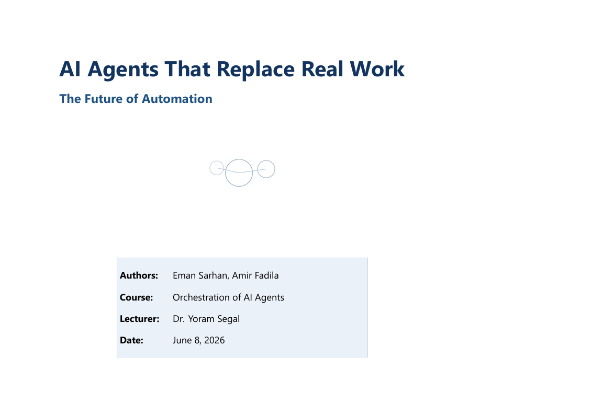
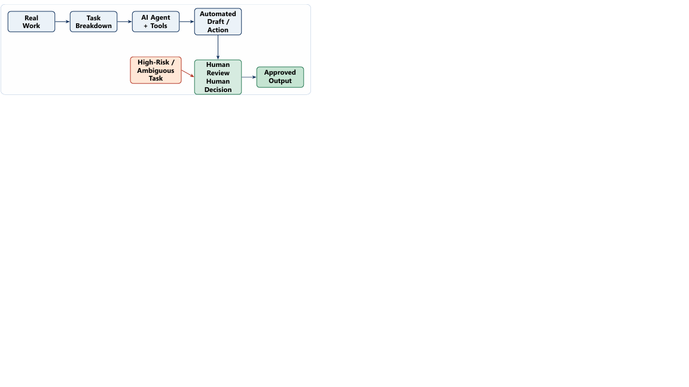
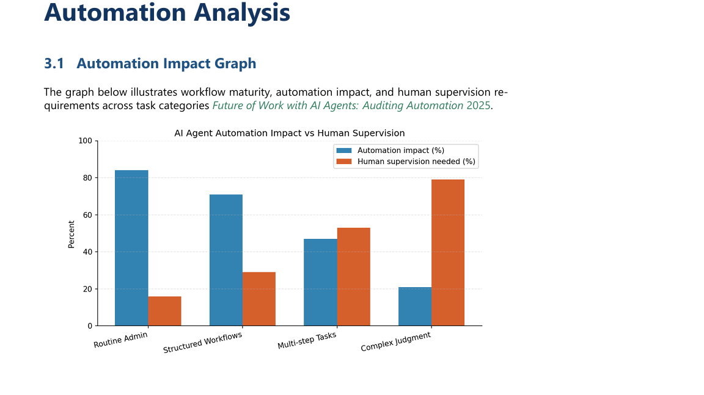
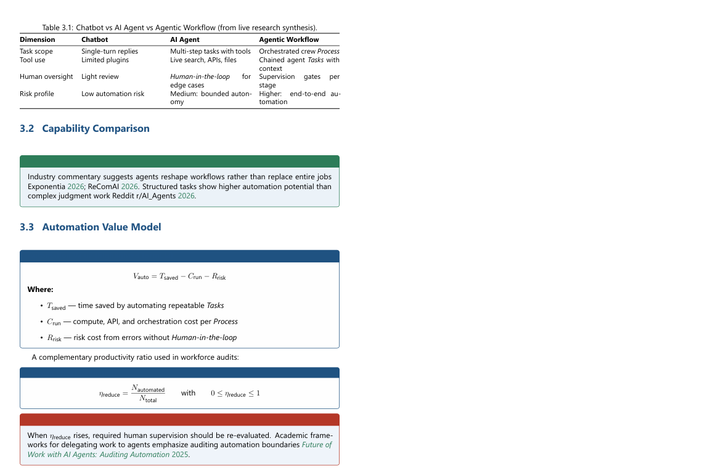
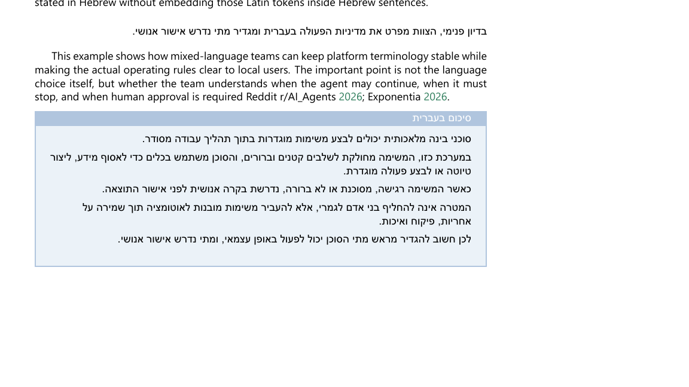
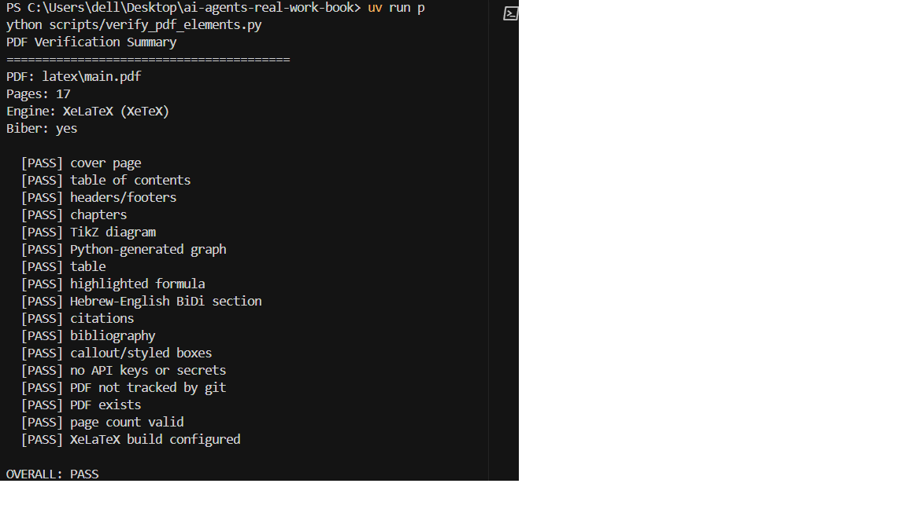
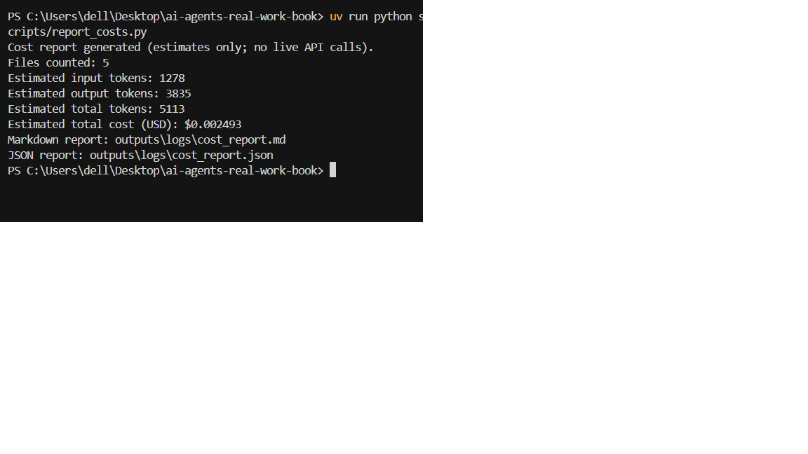
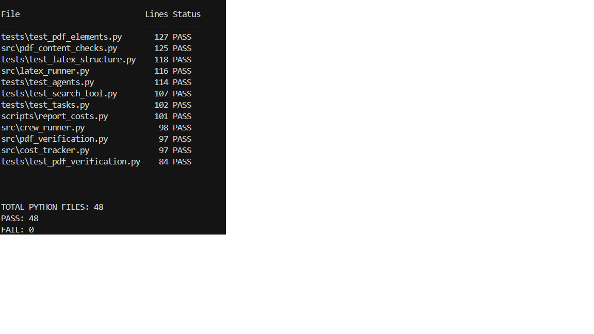

# AI Agents That Replace Real Work · CrewAI → Live Research → LaTeX

**AI Agents That Replace Real Work: The Future of Automation**

| | |
|---|---|
| **Authors** | Eman Sarhan, Amir Fadila |
| **Course** | Orchestration of AI Agents |
| **Lecturer** | Dr. Yoram Segal |
| **Repository** | [github.com/Emansa12/ai-agents-real-work-book](https://github.com/Emansa12/ai-agents-real-work-book) |

`Python 3.11+` · `uv` · `CrewAI` · `XeLaTeX` · `Tests 96 passing`

---

This project demonstrates a production-style AI-agent workflow. A CrewAI team performs **live internet research**, writes and reviews chapter content, and prepares LaTeX fragments that compile into a professionally typeset mini-book. The book focuses on how AI agents change **real work** through task-level automation, human-in-the-loop supervision, workflow orchestration, risks, metrics, and bilingual Hebrew–English terminology for agent platforms.

The pipeline is end-to-end: topic in, evidence-backed prose out, then XeLaTeX + biber produce a submission-ready PDF. The production content path is designed around live research artifacts and reviewed agent drafts.

---

## Final deliverable

| Item | Detail |
|---|---|
| **Final PDF in GitHub** | `outputs/final/ai_agents_real_work_book.pdf` |
| **Local build output** | `latex/main.pdf` |
| **Build command** | `uv run python scripts/build_pdf.py` |
| **Page count** | 17 pages (verified) |
| **Verification** | `uv run python scripts/verify_pdf_elements.py` |
| **Report** | `outputs/logs/pdf_verification.md` |

The repository includes the final submission PDF at `outputs/final/ai_agents_real_work_book.pdf`. The local LaTeX build output remains `latex/main.pdf`; after rebuilding, copy the refreshed PDF to `outputs/final/ai_agents_real_work_book.pdf` before final submission.

---

## Architecture overview

This project is an end-to-end **AI-agent mini-book generation pipeline**. A topic enters the system, live web evidence is retrieved, specialized CrewAI agents draft and review chapter content, LaTeX fragments are prepared, and the final book is compiled and verified.

```text
Topic
  ↓
Live Serper search
  ↓
Researcher Agent
  ↓
Writer Agent
  ↓
Reviewer Agent
  ↓
LaTeX Builder Agent
  ↓
XeLaTeX + biber
  ↓
Final PDF + verification report
```

- The **Researcher Agent** retrieves live web evidence through Serper and saves structured research artifacts.
- The **Writer Agent** uses retrieved research artifacts to draft chapter content.
- The **Reviewer Agent** checks clarity, citation alignment, and topic relevance.
- The **LaTeX Builder** prepares LaTeX-ready fragments under `latex/generated/`.
- The final book is compiled with **XeLaTeX and biber**, then checked by `scripts/verify_pdf_elements.py`.

Sequential tasks and shared context are defined in `src/tasks.py` and `src/crew_factory.py`. See `docs/workflow.md` for context flow details.

### CrewAI agent design

CrewAI models the work as a **team of specialized agents** instead of one large prompt. Each role has a narrow responsibility, and tasks pass context forward in a fixed research → write → review → LaTeX sequence.

| Component | Responsibility |
|---|---|
| Researcher Agent | Performs live internet research and prepares structured research notes |
| Writer Agent | Converts research notes into chapter prose |
| Reviewer Agent | Reviews clarity, correctness, and citation alignment |
| LaTeX Builder Agent | Produces LaTeX-ready content fragments |
| Verification scripts | Check required PDF elements, page count, citations, BiDi section, and secret safety |

### RAG-style live research

This project uses a **RAG-style workflow based on live internet search**. The system first retrieves external information through Serper, saves structured research artifacts under `outputs/research/`, and then uses those artifacts as grounding material for chapter generation.

It is **not** a full vector-database RAG system: there are no embeddings or vector store. Instead, it is a **live-search-grounded generation pipeline** built from auditable URLs, snippets, and saved agent artifacts.

### Object-oriented and modular architecture

The code is split into **small modules with clear responsibilities**:

| Area | Modules |
|---|---|
| Agent configuration | `src/agents.py`, `src/agent_config.py` |
| Task flow | `src/tasks.py`, `src/task_config.py`, `src/crew_factory.py` |
| Live research | `src/search_adapter.py`, `src/search_tool.py`, `src/search_models.py` |
| Cost/token estimation | `src/cost_tracker.py`, `src/cost_models.py`, `src/token_estimator.py` |
| PDF building | `src/pdf_build.py`, `src/latex_runner.py`, `src/latex_fragments.py` |
| PDF verification | `src/pdf_checks.py`, `src/pdf_content_checks.py`, `src/pdf_structure_checks.py`, `src/pdf_artifact_checks.py`, `src/pdf_report.py`, `src/pdf_verification.py` |
| CLI entry points | `scripts/*.py` — thin wrappers over `src/` helpers |

After refactoring, **every Python file** in `src/`, `scripts/`, and `tests/` is **under 150 lines**.

### TikZ and PDF design

TikZ is used for the workflow diagram inside the LaTeX source (`latex/diagrams.tex`). This makes the diagram part of the PDF design system rather than a pasted screenshot. The book also includes a Python-generated graph, structured tables, highlighted mathematical formulas, and styled callout boxes. The final PDF is compiled with **XeLaTeX and biber** so that English, Hebrew, citations, and bibliography rendering remain stable.

---

## Assignment requirements coverage

| Required element | Where it is implemented | Verification |
|---|---|---|
| Cover page | `latex/main.tex` | `scripts/verify_pdf_elements.py` — PASS |
| TOC + chapters | `latex/main.tex` | PASS |
| Headers/footers | `latex/preamble.tex` | PASS |
| TikZ diagram | `latex/diagrams.tex` | PASS |
| Python graph | `scripts/make_figures.py`, `assets/automation_impact_graph.png`, `latex/figures.tex` | PASS |
| Table | `latex/tables.tex` | PASS |
| Highlighted formula | `latex/formulas.tex` | PASS |
| Hebrew–English BiDi | `latex/bidi_section.tex`, `latex/preamble.tex` | PASS |
| Citations / bibliography | `latex/references.bib`, biblatex + biber | PASS |
| Callout boxes | `latex/preamble.tex`, chapter files | PASS |
| No secrets in sources | `.env` gitignored, verification scan | PASS |

---

## Repository structure

```
ai-agents-real-work-book/
├── src/                 # CrewAI agents, tasks, search adapter, cost tracking
├── scripts/             # run_crew, build_pdf, verify_pdf_elements, make_figures, …
├── latex/               # main.tex, preamble, diagrams, figures, tables, formulas, BiDi
├── assets/              # Python-generated graph (automation_impact_graph.png)
├── outputs/             # research, drafts, reviews, logs (including verification report)
├── tests/               # pytest suite (96 tests)
├── docs/                # workflow notes and submission screenshots
├── README.md            # this file
├── PRD.md               # product requirements
├── PLAN.md              # implementation phases
└── TODO.md              # task tracking
```

---

## Quickstart

### 1. Install dependencies

```bash
uv sync
```

Requires [uv](https://docs.astral.sh/uv/) and Python 3.11+.

### 2. Configure API keys

**Linux / macOS:**

```bash
cp .env.example .env
```

**Windows (PowerShell):**

```powershell
copy .env.example .env
```

Edit `.env` and set:

```env
OPENAI_API_KEY=your_openai_key_here
SERPER_API_KEY=your_serper_key_here
```

`MODEL_NAME` is optional (defaults to `gpt-4o-mini`). Never commit `.env` or real keys.

### 3. Verify configuration

```bash
uv run python scripts/check_config.py
```

Expect `Config loaded successfully` and `OPENAI_API_KEY: present` / `SERPER_API_KEY: present` (values are never printed).

### 4. Optional — one live search (Serper only)

```bash
uv run python scripts/run_live_search.py
```

Evidence is saved under `outputs/research/`.

### 5. Run one chapter crew (live OpenAI + Serper)

**Warning:** uses paid API calls.

```bash
uv run python scripts/run_crew.py
```

Other options:

```bash
uv run python scripts/run_crew.py --chapter 2
uv run python scripts/run_crew.py --all
```

Artifacts: `outputs/research/`, `outputs/drafts/`, `outputs/reviews/`, `outputs/logs/`, `latex/generated/`.

### 6. Generate graph asset (no API keys)

```bash
uv run python scripts/make_figures.py
```

### 7. Build the PDF (XeLaTeX + biber)

Requires a local TeX distribution with `xelatex` and `biber` (MiKTeX or TeX Live).

```bash
uv run python scripts/build_pdf.py
```

Output: `latex/main.pdf`. The script prefers `latexmk -xelatex`; on Windows/MiKTeX without Perl it falls back to `xelatex` → `biber` → `xelatex` → `xelatex`.

### 8. Verify required PDF elements

```bash
uv run python scripts/verify_pdf_elements.py
```

Writes `outputs/logs/pdf_verification.md` and prints a PASS/FAIL summary.

### 9. Tests and lint

```bash
uv run pytest
uv run ruff check .
uv run ruff format --check .
```

### 10. Optional — cost report from saved artifacts

```bash
uv run python scripts/report_costs.py
```

Writes `outputs/logs/cost_report.md` and `cost_report.json` (approximate token/cost estimates; no live API calls).

---

## Build and verification evidence

Latest local verification (re-run commands above to refresh):

| Check | Result |
|---|---|
| PDF page count | 17 pages |
| Verification script | **PASS** (all required elements) |
| pytest | **96 passed** |
| ruff | **all checks passed** |
| biber | succeeded (`latex/main.bbl` populated) |
| Build engine | **XeLaTeX** (XeTeX) |

Full checklist: `outputs/logs/pdf_verification.md`

---

## Security and secrets

- `.env` is gitignored; `.env.example` contains placeholders only.
- Do not commit API keys, tokens, or real credentials.
- `scripts/verify_pdf_elements.py` scans LaTeX sources for common secret patterns.
- `latex/main.pdf` remains a local generated build artifact. Only the final submission copy `outputs/final/ai_agents_real_work_book.pdf` is intended to be tracked in GitHub.

---

## Design decisions

| Decision | Rationale |
|---|---|
| **CrewAI orchestration** | Specialized agents (research, write, review, LaTeX) mirror a real editorial pipeline better than one monolithic prompt |
| **RAG-style live search** | Serper retrieves live web evidence; saved artifacts ground chapter generation without a vector database |
| **Modular object-oriented architecture** | Small `src/` modules and thin `scripts/` CLIs keep responsibilities clear and testable |
| **TikZ design** | Workflow diagram is native LaTeX vector graphics, not an external screenshot pasted into the PDF |
| **XeLaTeX + biber + polyglossia** | Stable English/Hebrew BiDi rendering, linked citations, and bibliography through biblatex and biber |
| **150-line modularity** | Every Python file in `src/`, `scripts/`, and `tests/` stays under 150 lines for course submission requirements |
| **Source-level PDF verification** | `verify_pdf_elements.py` checks LaTeX sources and build artifacts—not OCR |
| **Cost tracking** | `report_costs.py` estimates API usage from saved artifacts for budget awareness |
| **uv** | Reproducible dependency management and script execution |

---

## Submission checklist

- [x] GitHub repository pushed and accessible to lecturer
- [x] `uv run pytest` passes (96 tests)
- [x] `uv run ruff check .` passes
- [x] `uv run python scripts/build_pdf.py` produces `latex/main.pdf`
- [x] `uv run python scripts/verify_pdf_elements.py` reports **PASS**
- [x] No `.env` or API keys committed
- [x] Final PDF exists in GitHub at `outputs/final/ai_agents_real_work_book.pdf`

---

## Screenshots

The following screenshots provide visual evidence for key submission requirements.

| Screenshot | Evidence shown |
| --- | --- |
| `docs/screenshots/final_pdf_cover.png` | Final compiled PDF cover page with title, authors, course, lecturer, and date |
| `docs/screenshots/tikz_workflow_diagram.png` | TikZ workflow diagram rendered inside the PDF |
| `docs/screenshots/graph_element.png` | Python-generated graph inside the PDF |
| `docs/screenshots/required_pdf_elements.png` | Table, highlighted formulas, and styled boxes |
| `docs/screenshots/bidi_section.png` | Hebrew–English BiDi content rendered correctly |
| `docs/screenshots/pdf_verification_pass.png` | Verification script reports OVERALL PASS |
| `docs/screenshots/cost_report.png` | Token/cost estimation report |
| `docs/screenshots/line_count_pass.png` | Python source files satisfy the 150-line limit |

### Final PDF cover



This screenshot shows the compiled PDF cover page. It proves that the final deliverable includes a proper title page with the book title, authors, course name, lecturer, and submission date.

### TikZ workflow diagram



This screenshot shows the workflow diagram rendered inside the PDF. The diagram is created with TikZ in LaTeX, so it demonstrates that the project includes a native LaTeX architecture/workflow diagram rather than only external images.

### Python-generated graph



This screenshot shows the Python-generated graph included in the PDF. The figure was produced by the project's Python plotting script and satisfies the requirement for a graph generated by code.

### Required PDF elements



This screenshot shows several required PDF elements on the same page: a structured table, highlighted mathematical formulas, and styled callout boxes. It demonstrates that the PDF is designed as a polished technical document rather than plain text.

### Hebrew–English BiDi section



This screenshot shows the Hebrew-English BiDi section rendered in the compiled PDF. It demonstrates that the project supports mixed Hebrew and English terminology correctly using the XeLaTeX setup.

### PDF verification PASS



This screenshot shows the verification script output with `OVERALL: PASS`. It proves that the automated checklist found the required PDF elements, page count, citations, bibliography, BiDi section, and secret-scan checks.

### Cost/token report



This screenshot shows the generated token and cost report. The report is based on saved artifacts and provides budget awareness without making additional live API calls.

### 150-line source-file check



This screenshot shows the final line-count check after the modular refactor. It proves that every Python file in `src/`, `scripts/`, and `tests/` is under 150 lines.

---

## Documentation

- `PRD.md` — product requirements
- `PLAN.md` — implementation phases (M0–M12)
- `TODO.md` — task tracking and Definition of Done
- `docs/workflow.md` — CrewAI context flow

---

## Live research requirement

This project requires live API-based internet research. There is no offline or fake production mode. If required API keys are missing at runtime, scripts fail with a clear error. Book content is intended to trace back to live research artifacts and reviewed agent outputs, not static hardcoded content.
